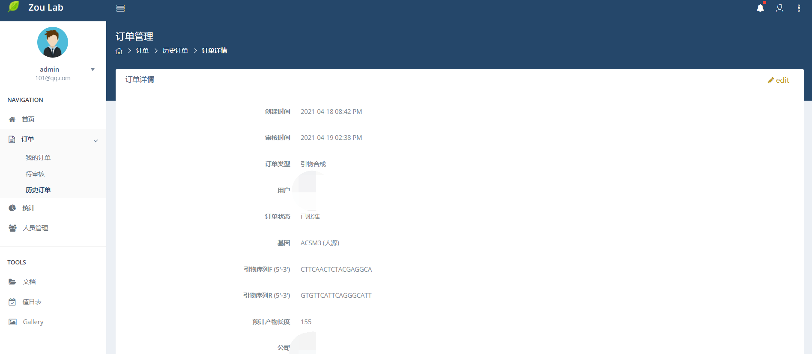
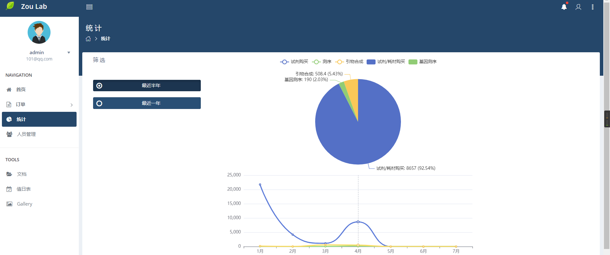
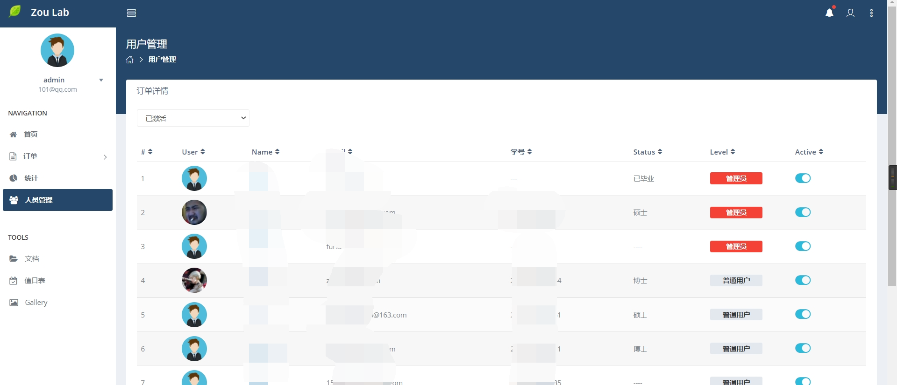

## LabManager 生物学实验室管理系统

## 主要功能
- 实验室人员, 权限管理
- 试剂, 基因测序, 耗材购买订单审批
- 账目审计, 可视化统计

## 其他功能
- 共享文件
- 基因 ID 转换工具
- 富集分析, qPCR 计算等
- 这些都没有实现 (钱不够, 框架未定, 代码暂无)

## 环境依赖
- python 3.6+
- MySQL 8.0
- Django 2.2.12
- mysqlclient 2.0.1
- PyMySQL 0.10.1
- redis 3.5.3
- xlwt 1.3.0

## screenshots

